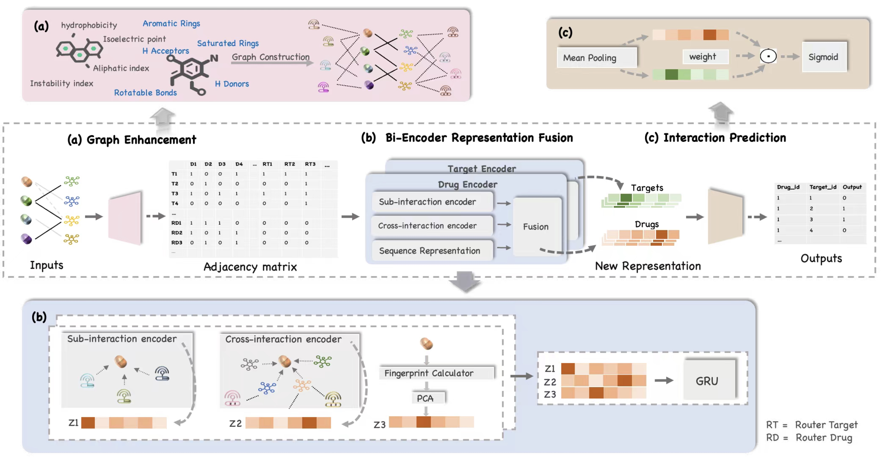

# GENNDTI : Graph Enhanced Neural Network for drug-target interaction prediction

* This is the code for our paper "GENNDTI : Graph Enhanced Neural Network for drug-target interaction prediction''.
* GENNDTI consists of three parts: (1) a graph enhancement module that processes the sub-interaction construction, (2) a message-generating module that uses both real interactions and sub-interactions, and (3) an inference module that fuses the information obtained from step 2 for prediction.

## Overview 
 

## Environmental Requirement


1. Download the code and data.

   clone this repository:
   ```
   $ git clone https://github.com/JieZheng-ShanghaiTech/GENNDTI.git
   ```
   if you have configed the SSH key for github, otherwise, use
    ```
   $ git clone git@github.com:JieZheng-ShanghaiTech/GENNDTI.git
   ```
   Then go to the folder of the repository:
   ```
   $ cd GENNDTI
   ```

   Now, our source codes are in the folder ```code/```


2. You need to set up the environment for running the experiments. First, you can install Anaconda by following the instruction from  the [website](https://docs.anaconda.com/anaconda/install/).
  ```
  $ conda env create -f DTI.yaml
  $ conda activate DTI
  ```

## Prepare for training'
Run ```Prepare.py``` to generate the dataset and the coresponding split.
```angular2html
$ python prepare.py
```
Run ```feature-construct.py``` to generate drug and target features.
```angular2html
$ python feature-construct.py
```

## Run the code


1. Go to the ```code/``` folder and run the ```main.py``` file:
   ```
   $ cd code
   $ python .\main.py --dataset=davis --num_user_features=11 --dim=64 --hidden_layer=256 
   ```
Main arguments:
   ```
   --dataset [davis, KIBA]: the dataset to run
   --dim: the embedding dimension of each attribute
   --hidden_layer: the MLP hidden layer for the inner interaction modeling function
   --l2_weight: the regularization weight
   --lr: the learning rate
   --num_user_features: the number of user attributes. Currently we assume all users have the same number of attributes. Here are 11 for both dataset.
   ```
   For more argument options, please refer to ```main.py```

In default, we run the best model for each split of a dataset 5 times. The tool to
get a summary is listed in the below.

2. Get the summary report and show the similarity graph

The training result will be recorded in the ```code/train_res_{YOUR_DATASET}```
There are blocks in ```stat.py``` to get the final result and give a simple report in ```code\summary.txt```.
You can refer to the code for detail.

## Acknowledgement

The code is inspired by GMCF. 
```
> [Neural Graph Matching based Collaborative Filtering](https://dl.acm.org/doi/abs/10.1145/3404835.3462833)  
> Su, Yixin, et al. "Neural graph matching based collaborative filtering." Proceedings of the 44th international ACM SIGIR conference on research and development in information retrieval. 2
```


